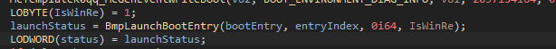
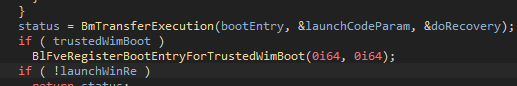
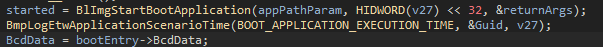
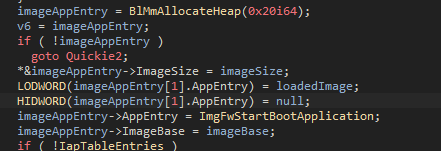
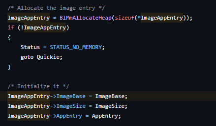
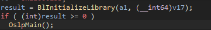
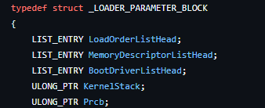

# Faceit cheat

## 📌 Todo list
- [X] Communication
- [X] Safe memory read
- [ ] Very safe memory read :)
- [X] EFI Bootloader Application to map driver
- [ ] Usermode cheat
- [ ] Complete file system in Bootloader

Some words about Bootloader: Due to the fact that bootloader was written a little earlier in a separate project, I decided to use the same code style for it as Microsoft in their bootloader (see bootmgfw.efi, winload.efi).

## 🎮 Usage
In development... ☕

## 🔨 Build

### Bootloader
After all go to `Bootloader/VisualUefi/EDK-II` open `EDK-II.sln` in Visual Studio and build in **x64 Release** mode

**MAKE SURE YOU ARE CLONED REPOSITORY WITH ALL SUBMODULES**

## 💉 Debugging

### Bootloader

26.10.2024 - No more needed. Just build project with CMake and qemu will start automatically

If you are in **CLion**, click on `Run Configurations` then `Edit Configurations`. Add new configuration with type Shell Script. Select **type** `Script Text` and paste:
```
.\qemu.exe -name "UEFI Debugger" -drive file=OVMF_CODE-need-smm.fd,if=pflash,format=raw,unit=0,readonly=on -drive file=OVMF_VARS-need-smm.fd,if=pflash,format=raw,unit=1 -drive file=fat:rw:..\..\dist\Release,media=disk,if=virtio,format=raw -drive file=UefiShell.iso,format=raw -m 512 -machine q35,smm=on -nodefaults -vga std -global driver=cfi.pflash01,property=secure,value=on -global ICH9-LPC.disable_s3=1 -device ich9-intel-hda,id=sound0,bus=pcie.0,addr=0x1b -device hda-duplex,id=sound0-codec0,bus=sound0.0,cad=0 -global ICH9-LPC.disable_s3=1 -global ICH9-LPC.disable_s4=1 -soundhw all
```

In **Visual Studio**, click on `Bootloader` then `Properties`. In opened window select `Debugging`. Paste this:
- Command: `debugger/qemu.exe`
- Command Arguments: `-name "UEFI Debugger" -drive file=OVMF_CODE-need-smm.fd,if=pflash,format=raw,unit=0,readonly=on -drive file=OVMF_VARS-need-smm.fd,if=pflash,format=raw,unit=1 -drive file=fat:rw:..\..\dist\Release,media=disk,if=virtio,format=raw -drive file=UefiShell.iso,format=raw -m 512 -machine q35,smm=on -nodefaults -vga std -global driver=cfi.pflash01,property=secure,value=on -global ICH9-LPC.disable_s3=1 -device ich9-intel-hda,id=sound0,bus=pcie.0,addr=0x1b -device hda-duplex,id=sound0-codec0,bus=sound0.0,cad=0 -global ICH9-LPC.disable_s3=1 -global ICH9-LPC.disable_s4=1 -soundhw all`
- Working Directory: `debugger`
- Attach: `No`
- Debugger Type: `Script`

## 📄 Driver documentation

### 📚 Routine
To simplify the coding of drivers, I made a small library called Routine.
Just add `#include <Routine/Routine.h>` in code for using all functional

#### Allocator
Functions:

- `PVOID Allocator::AllocateKernel(IN SIZE_T size)`
  <br>
  Allocates non paged pool
  <br>
  Parameters:
  - size - Specifies a non-zero number of bytes to allocate
<br><br>
- `void Allocator::FreeKernel(IN PVOID buffer)`
  <br>
  Free pool memory
  Parameters:
  - buffer - Buffer of pool block memory
<br><br>
- `PVOID Allocator::AllocatePhysical(IN SIZE_T size, IN PVOID virtualAddress, IN ULONG protect, OUT PMDL* outMdl)`
  <br>
  Maps physical memory and sets protection
  <br>
  Parameters:
  - size - Non-zero number of bytes to allocate
  - virtualAddress - Address of virtual memory being mapped
  - protect - Specifies the new protection for memory pages. [See for protects](https://learn.microsoft.com/en-us/windows-hardware/drivers/ddi/wdm/nf-wdm-mmprotectmdlsystemaddress)
  - outMdl - A pointer to variable where MDL is returned
<br><br>
- `void Allocator::FreePhysical(IN PVOID buffer, IN PMDL mdl)`
  <br>
  Free mapped mdl
  Parameters:
  - buffer - Buffer of pool block memory
  - mdl - Pointer to MDL

Allocator also supports **new** and **delete** operators for allocating non paged pool memory

#### String
Wrapper for C-Style, Unicode and Ansi strings

Constructors:
- `String(IN PCSTR cstring)`
- `String(IN PUNICODE_STRING unicodeString)`
- `String(IN PANSI_STRING ansiString)`

Functions:
- `static String::Format(IN PCSTR text, IN Args... args)`
  <br>
  Formats the C-Style string with specified arguments.
  <br>
  Parameters:
  - text - C-Style string which specifies format
  - args - Format arguments
<br><br>
- `PANSI_STRING String::AnsiString() const`
  <br>
  Returns pointer to ansi string
<br><br>
- `PUNICODE_STRING String::UnicodeString() const`
  <br>
  Returns pointer to unicode string
<br><br>
- `PCSTR String::CString() const`
  <br>
  Returns pointer to C-Style string
<br><br>
- `SIZE_T String::Length() const`
  <br>
  Returns length of string
<br><br>
- `static PANSI_STRING String::UnicodeToAnsi(IN PUNICODE_STRING unicodeString)`
  <br>
  Converts unicode string to ansi string
  <br>
  Parameters:
  - unicodeString - Pointer to unicode string
<br><br>
- `static PUNICODE_STRING String::AnsiToUnicode(IN PANSI_STRING ansiString)`
  <br>
  Converts ansi string to unicode string
  <br>
  Parameters:
  - ansiString - Pointer to ansi string

#### Thread
Very very very basic threads

Functions:
- `NTSTATUS Thread::CreateThread(IN THREAD_START_ROUTINE startRoutine, IN Thread thread)`
  <br>
  Creates thread and saves handle
  <br>
  Parameters:
  - startRoutine - Start function routine
  - thread - Thread to save handle
<br><br>
- `NTSTATUS Thread::CloseThread(IN Thread thread)`
  <br>
  Closes thread
  <br>
  Parameters:
  - thread - Thread for closing

#### Memory

Functions:
- `PVOID Memory::GetSystemModuleBase(IN PCSTR path)`
  <br>
  Gets system module/driver base by full path name
  <br>
  Parameters:
  - path - Full path name string
- `PVOID GetExport(IN PVOID moduleBase, IN PCSTR functionName)`
  <br>
  Gets export from system module
  <br>
  Parameters:
  - moduleBase - Address of system module
  - functionName - Function name
<br><br>
- `void Memory::AttachProcess(IN PEPROCESS process)`
  <br>
  Safe attaches to specified process
  <br>
  Parameters:
  - process - Process to attach
  <br>
  Credits: https://www.unknowncheats.me/forum/anti-cheat-bypass/489305-read-write-process-attach.html
<br>
- `void Memory::DetachProcess()`
  <br>
  Detaches from previous process
<br><br>
- `PHYSICAL_ADDRESS Memory::SafeMmGetPhysicalAddress(IN PVOID virtualAddress)`
  <br>
  Translates virtual address to physical
  <br>
  Parameters:
  - virtualAddress - Virtual address
<br><br>
- `NTSTATUS Memory::ReadVirtualMemory(IN PEPROCESS process, OUT PVOID destination, IN PVOID source, IN SIZE_T size)`
  <br>
  Safe reads virtual memory
  <br>
  Parameters:
  - process - Process to read from
  - destination - Destination buffer
  - source - Virtual address
  - size - Non-zero number of bytes to read

#### Utils

Functions:
- `NTSTATUS Utils::Sleep(IN ULONGLONG milliseconds)`
  <br>
  Sleeps current thread
  <br>
  Parameters:
  - milliseconds - Non-zero number of milliseconds
  <br>
  Credits: https://github.com/vRare/AutoSpitta-x64/blob/master/hacks.c#L9
<br>
- `void Utils::LogToFile(IN String filePath, IN PCSTR text, IN Args... args)`
  <br>
  Formats string and appends text to file
  <br>
  Parameters:
  - filePath - Path to output file
  - text - C-Style string which specifies format
  - args - Format arguments

#### Process

Why did I separate them from Memory? Because I want the opaque windows structures for process to be in a separate file

Functions:
- `PVOID Process::GetModuleBaseProcess(IN PEPROCESS process, IN String moduleName)`
  <br>
  Safe gets base of process module by name
  <br>
  Parameters:
  - process - Process to get from
  - moduleName - Module name string

#### Communication

Where is basic type for communication pipe. It has **Install** for setup communication and custom printable C-Style string id.

Functions:
- `NTSTATUS Communication::Setup(IN CommunicationPipe* pipe, IN CommunicateRoutine routine)`
  <br>
  Setups communication through pipe
  <br>
  Parameters:
  - pipe - Specified communication pipe
  - routine - Communication routine function

Pipes:
- `IoctlPipe`. Setups ioctl in driver object. **Limitations**: has big violation vector of anticheat
- `FunctionPointerSwapPipe`. Hooks any function (current is NtCompareSigningLevels) and checks cookie. **Limitations**: changes windows kernel which triggers the PatchGuard

## 🧠 Explanation

### Bootloader

Where is 2 types of firmware: Bios and UEFI. We are only considering UEFI. UEFI starts from Windows Boot Manager - the file responsible for further system startup. This file located in a special partition and has name `bootmgfw.efi`. Through command in terminal `mountvol X: /S` we can mount this partition and get this file using some utilities (I use Explorer++). Let's go to write custom UEFI Application bootloader to start this file manually.

I will not describe the entire code, you can simply open the VisualUefi/EDK2 documentation to learn more about it.
Using my FileSystem wrapper I can easily find this file:
```c
SIZE_T count = 0;
PVOLUME volumes;
FsListVolumes(&volumes, &count);

EFI_DEVICE_PATH* devicePath = NULL;

for (SIZE_T i = 0; i < count; i++) {
    VOLUME volume = volumes[i];

    FsOpenVolume(&volume);

    if (!EFI_ERROR(FsLocateFile(volume, BOOTMGFW_FILE_PATH, EFI_FILE_MODE_READ, EFI_FILE_READ_ONLY, devicePath))) {
        FsCloseVolume(volume);
        break;
    }

    FsCloseVolume(volume);
}
```

Next, using the device path, load the image and start:
```c
gBS->LoadImage(TRUE, gImageHandle, devicePath, NULL, 0, imageHandle);
gBS->StartImage(imageHandle, NULL, NULL);
```

Take a USB flash (or rename original bootmgfw.efi) and copy built bootloader to `EFI\Boot\bootx64.efi`. In Bios Setup set USB flash to First boot order. Starts successfully.

Naturally, there is something interesting hidden inside this file)). The efi files themselves have PE format (which is quite strange, because Microsoft has nothing to do with UEFI). Opening the file in IDA. Through a ton of shit from boot options and etc, we find BmpLaunchBootEntry:



Then find BmTransferExecution



Then find BlImgLoadBootApplication



ImgFwStartBootApplication with appEntry:



From reactos:



In ImgFwStartBootApplication just jump to ImgArchStartBootApplication. ImageBase and ImageSize points to the `winload.efi`.

Opening winload in IDA. We pay attention to BlImgAllocateImageBuffer and BlpArchSwitchContext in advance, we will need it soon.  Go to OslpMain (which I don't decompile).



There we also see OslExecuteTransition, which calls OslFwpKernelSetupPhase1. That's enough. It has only one parameter - OS loader block.

This struct is described in ReactOS:



After going through the **LoadOrderListHead**, we notice `ntoskrnl.exe`. Hooking BlImgAllocateImageBuffer to allocate buffer for driver and OslFwpKernelSetupPhase1 for mapping. Using the previously obtained ntoskrnl.exe we can easily map driver and resolve imports (See MpMapAndResolveDriver)
